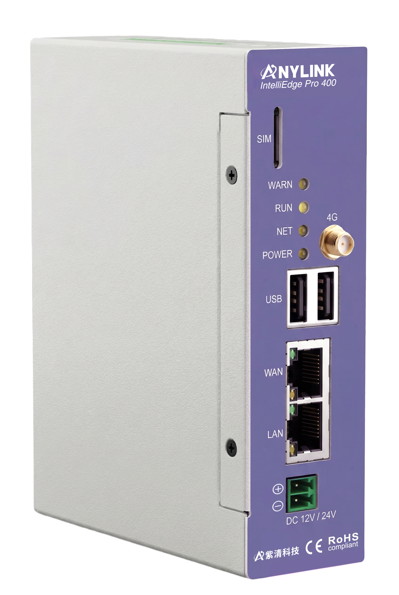

# IE Pro 400 Global Standard Datasheet

English | [中文](../zh-CN/01-datasheet.md)

**Doc No.**: DS-IEP400-GS-001　**Version**: V1.0　**Date**: 2026-07-22　**Classification**: Public / For Developers

---

## 1. Product Overview

IE Pro 400 Global Standard is a general-purpose industrial gateway from the IE Pro series, designed for overseas and wide-area IoT deployments. It features industrial-grade hardware and ships with a standard Linux OS. **No AnyLink application or cloud platform is pre-installed** — the device is delivered as a "hardware platform + standard system interfaces" kit, enabling customers to develop and deploy their own acquisition, control, and northbound communication applications.

- **Target users**: system integrators, industry solution developers
- **Typical use cases**: remote device connectivity, industrial field data acquisition (Modbus, etc.), vehicle/mobile deployments, edge data processing, DI/DO control and linkage
- **Differences from the domestic IEPro**:
  - No AnyLink application or cloud platform pre-installed; customers integrate their own software stack
  - 4G module: SIM7600G-H-PCIE (global bands; see §3.5)
  - Global Standard branding for the worldwide market edition

## 2. Hardware Specifications

### 2.1 Processor & Storage

| Item | Spec |
|---|---|
| CPU | 528 MHz ARM Cortex-A7 |
| RAM | 512 MB DDR2 SDRAM |
| Flash/Storage | 4 GB NAND Flash; TF card expansion supported |
| OS | Linux (vendor pre-installed standard distribution) |
| RTC | Built-in RTC with backup battery for power-loss retention |

### 2.2 Mechanical

| Item | Spec |
|---|---|
| Dimensions (L×W×H) | 39 × 106 × 136 mm |
| Weight | Approx. 507 g |
| Mounting | DIN-rail clip mounting |
| Ingress protection | IP51 |
| Enclosure material | Industrial-grade engineering plastic |

### 2.3 Power

| Item | Spec |
|---|---|
| Input voltage range | 9–36 V DC (wide input) |
| Rated power consumption | 8 W |
| Power connector type | Terminal block |
| Reverse-polarity / surge protection | 9–36 V withstand range; PPTC resettable fuse; overcurrent protection; lightning surge ±4 kV |

### 2.4 Environmental

| Item | Spec |
|---|---|
| Operating temperature | -40 °C to +85 °C |
| Storage temperature | See product nameplate |
| Operating humidity | 5%–95% RH, non-condensing |
| Vibration resistance | 10–25 Hz (2G for 30 min along X, Y, and Z axes) |
| Cooling method | Natural air cooling |
| EMC | EFT/burst ±4 kV; air discharge 8 kV; compliant with EN55022 |

## 3. Interfaces

### 3.1 Network

| Interface | Qty | Notes |
|---|---|---|
| Ethernet (WAN/LAN) | 2 | 10/100 M auto-negotiation, RJ45; factory defaults: WAN `192.168.100.126`, LAN `192.168.101.204` |
| 4G/Cellular | 1 | SIM7600G-H-PCIE module (bands in §3.5) |
| Wi-Fi | Not supported | — |

### 3.2 Serial Ports

| Interface | Qty | Electrical Standard | Notes |
|---|---|---|---|
| RS232 | 1 | RS-232 | Baud rate 600–256000; device node `/dev/ttymxc5` |
| RS485 | 2 | RS-485 | Baud rate 600–256000; automatic direction control in hardware (no software DE/RE switching); device nodes `/dev/ttymxc1` (RS485-1), `/dev/ttymxc2` (RS485-2) |

### 3.3 CAN

| Item | Spec |
|---|---|
| Qty | 1 |
| Protocol | CAN 2.0 |
| Baud rate range | 5 Kbps–1 Mbps |
| System interface name | `can0` (CAN module installed at factory) |
| Termination resistor | Configure per bus topology (120 Ω at each end recommended for long/multi-node buses) |

### 3.4 Digital I/O

| Item | Spec |
|---|---|
| DI count | 1 (X1) |
| DI type | **Passive input** (dry contact); short to GND = 1, open = 0; GPIO 117 |
| DO count | 1 (Y1) |
| DO type | **Passive output** (dry contact switch output); GPIO 118 |
| DIP switches | 2 (GPIO 121, GPIO 124) |

### 3.5 Cellular (4G) Specifications

| Item | Spec |
|---|---|
| Module model | SIM7600G-H-PCIE (SIMCOM) |
| Standard | GSM/GPRS/EDGE, WCDMA/UMTS/HSPA+, LTE-FDD, LTE-TDD |
| LTE-FDD bands | B1/B2/B3/B4/B5/B7/B8/B12/B13/B18/B19/B20/B25/B26/B28/B66 |
| LTE-TDD bands | B34/B38/B39/B40/B41 |
| WCDMA/UMTS/HSPA+ bands | B1/B2/B4/B5/B6/B8/B19 |
| GSM/GPRS/EDGE | 850/900/1800/1900 MHz |
| SIM slot | 1 (standard SIM slot) |
| Antenna connector | External 4G antenna (included in shipment) |
| Module power control | GPIO 69 (OUT); **off by default at boot** (0=off, 1=on); enable before 4G use — see [4G Connectivity Example](03-4g-connectivity.md) §2 |
| Dial-up method | NDIS dial-up (`AT$QCRMCALL`) |

### 3.6 Other Interfaces

| Interface | Notes |
|---|---|
| USB 2.0 | 2 | USB 2.0 host ports |
| SD/TF card slot | TF card storage expansion supported |
| Debug console | Serial console (parameters in [Quickstart Guide](02-quickstart.md)) |
| Indicator LEDs | POWER (power supply, on when powered); NET (GPIO 122, network), RUN (GPIO 71, system), WARN (GPIO 123, warning); GPIO LEDs: on=1, off=0 |
| Buttons | Reset (GPIO 119): pressed=1, released=0; factory firmware exposes GPIO state only — no built-in actions (e.g. factory reset); application logic is customer-developed |
| Hardware watchdog | `/dev/watchdog` (standard Linux watchdog character device; system resets if not fed before timeout) |

## 4. Software & Development Capabilities

| Item | Notes |
|---|---|
| Firmware version (matching this datasheet) | V1.0.0 (see [Release Notes](09-release-notes.md)) |
| Open interfaces | Serial (termios), CAN (SocketCAN), DI/DO (sysfs GPIO), hardware watchdog (`/dev/watchdog`), MQTT northbound, HTTP, Modbus; menu + CLI in [`demo/README.md`](../../demo/README.md); see [Demo Development Guide](05-demo-guide.md) for integration notes |
| Cross-compilation support | ARM `arm-linux-gnueabihf` toolchain; see [Cross-Compilation Toolchain Guide](06-cross-compile-toolchain.md) |
| Pre-installed business platform | **None** — device ships without AnyLink application or cloud platform; customers develop and deploy their own |
| Supported languages/SDKs | C/C++ (cross-compiled, recommended); device ships with **Python 2.7.14** (all demos in this repo are C and do not use Python) |

## 5. Certifications & Compliance

| Item | Notes |
|---|---|
| Applicable model | IE Pro 400 Global Standard |
| CE | Certificate KSEM2510003048 — [Download PDF](../certificates/eu/ce/CE-KSEM2510003048-certificate.pdf) |
| EMC | Certificate LCS200114008AE — [Download PDF](../certificates/eu/emc/EMC-LCS200114008AE-certificate.pdf) |
| RoHS | Certificate SHA19-251135-01 — [Download PDF](../certificates/eu/rohs/RoHS-SHA19-251135-01.pdf) |
| Radio (RED) | Certificate SUES2510002159 — [Download PDF](../certificates/eu/radio-safety/RED-SUES2510002159-certificate.pdf) |
| Full test reports | Not stored in this repo; email [developer@anylink.io](mailto:developer@anylink.io?subject=IEPro%20certificate%20request) |
| Other regions | FCC etc. per target market; cellular module: SIM7600G-H-PCIE |
| Export compliance | Customers must confirm import and radio compliance for their target markets |

Index: [`docs/certificates/README.md`](../certificates/README.md).

## 6. Ordering Information

| Model | Description | Notes |
|---|---|---|
| IE Pro 400 Global Standard | Standard kit: host + 4G antenna + DIN-rail clip + terminal blocks | No vendor business platform pre-installed |

---

**Included accessories**: 4G antenna, DIN-rail clip, terminal blocks.

> **Mass-production verified**: Standard kit and included accessories match final shipments of IE Pro 400 Global Standard.
