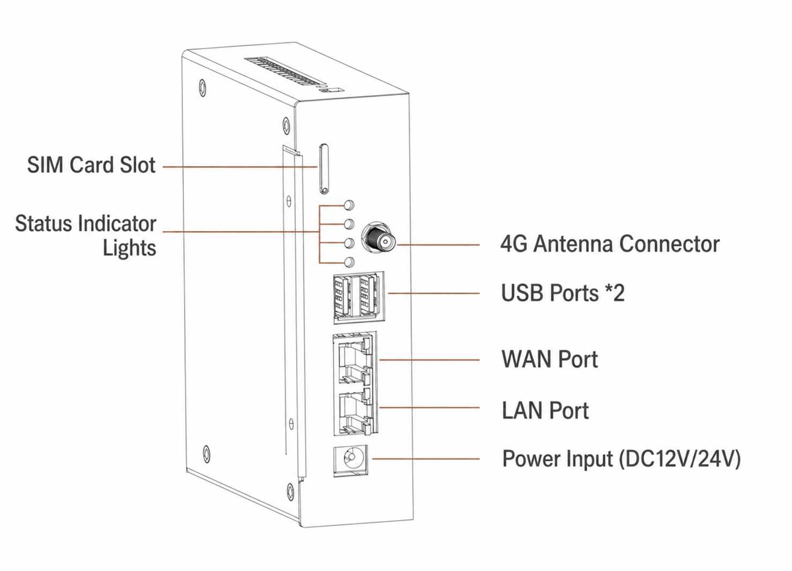
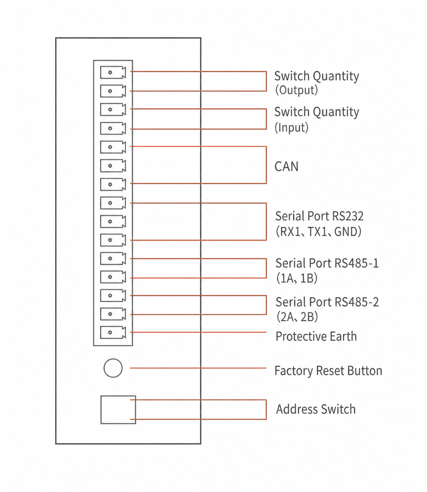
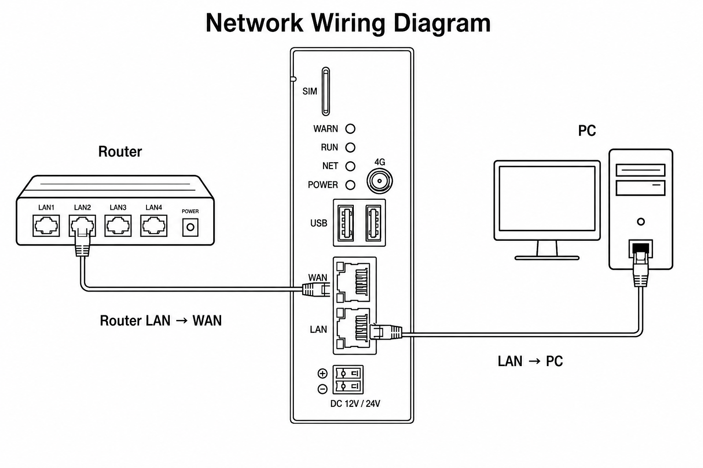
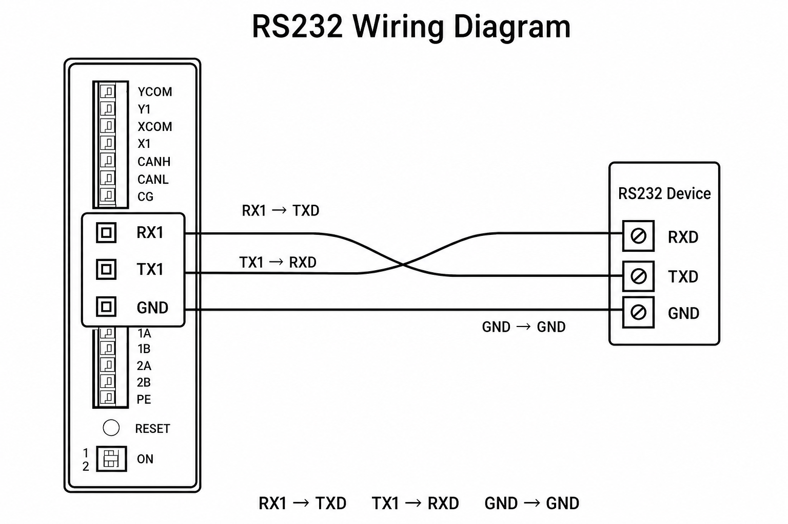
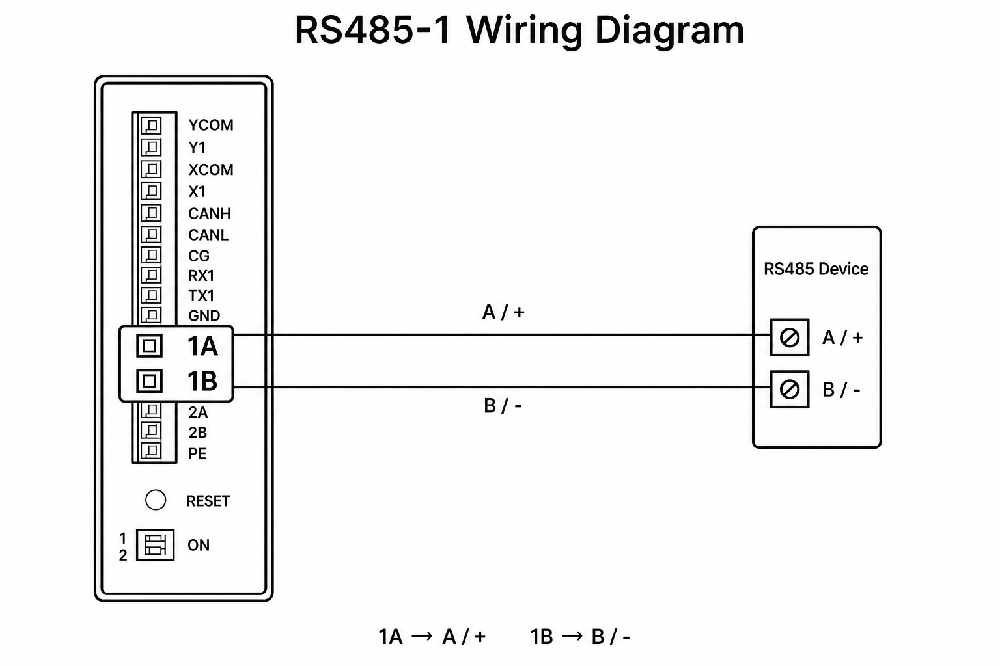

# IE Pro 400 Global Standard Quickstart Guide

English | [中文](../zh-CN/02-quickstart.md)

**Applicable model**: IE Pro 400 Global Standard　**Doc version**: V1.0　**Date**: 2026-07-22

## Introduction

This guide helps developers unbox, power on, log in via SSH, and verify connectivity within about 15 minutes — preparing you for the 4G/wired connectivity examples and Demo development that follow.

> **Note**: IE Pro 400 Global Standard does not ship with a vendor web management UI. Configuration and debugging are done via SSH on the command line.

## 1. Package Contents

| Item | Qty | Notes |
|---|---|---|
| IE Pro 400 Global Standard host | 1 | |
| Power terminal blocks | 1 set | For 9–36 V DC supply |
| 4G antenna | 1 | Connect to the device's 4G antenna port |
| DIN-rail clip | 1 set | For DIN-rail mounting |
| Quick-start card | 1 | |

> **Mass-production verified**: The package contents above match final shipments of IE Pro 400 Global Standard.

If anything is missing, contact AnyLink technical support at [anylink.io](https://anylink.io).

## 2. Power On

1. Confirm the power supply matches the nameplate (see [Datasheet](01-datasheet.md) §2.3): **9–36 V DC** wide-range input.
2. Connect power to the terminal block, observing correct polarity.
3. After power-on, check the indicator LEDs:

   | LED | GPIO | Normal state | Meaning |
   |---|---|---|---|
   | POWER | — | On when powered | Power indicator (hardware; not software-controlled) |
   | RUN | GPIO 71 | On or blinking | System running |
   | NET | GPIO 122 | On when connected | Network link established |
   | WARN | GPIO 123 | Off | On indicates a warning condition |

4. Boot time is approximately **60–90 seconds** (longer on first boot or after inserting a SIM card).

## 3. Wiring

### 3.1 Interface Overview

| Interface | Qty | Notes |
|---|---|---|
| 4G cellular | 1 | Connect 4G antenna; insert SIM card |
| Ethernet | 2 | WAN + LAN, 10/100 M auto-negotiation |
| RS485 | 2 | `/dev/ttymxc1`, `/dev/ttymxc2` |
| RS232 | 1 | `/dev/ttymxc5` |
| CAN 2.0 | 1 | `can0` (factory-installed CAN module) |
| USB 2.0 | 2 | USB 2.0 host ports |
| DI / DO | 1 each | X1 (GPIO 117) / Y1 (GPIO 118) |
| DIP switches | 2 | GPIO 121, GPIO 124 |
| Reset button | 1 | GPIO 119 |

<table>
  <tr>
    <td colspan="2"><strong>Front panel</strong></td>
  </tr>
  <tr>
    <td align="center" valign="middle" width="322">
      
    </td>
    <td align="center" valign="middle">
      
    </td>
  </tr>
  <tr>
    <td colspan="2"><strong>Terminal block</strong></td>
  </tr>
  <tr>
    <td align="center" valign="middle" width="322">
      
    </td>
    <td align="center" valign="middle">
      
    </td>
  </tr>
</table>

### 3.2 Ethernet (WAN / LAN)

The two RJ45 ports are on the **front panel**. Use a standard Ethernet cable.



For first-time SSH, connect the PC to **LAN**. Typical use and factory default IPs: see §5.1. IP changes and ping checks: [Wired Connectivity Example](04-wired-connectivity.md).

### 3.3 Serial Ports (RS232 / RS485)

The three field serial ports are on the **top terminal block** (see §3.1 pinout). This is not the Console port in §5.3.

| Port | Terminals | Device node |
|---|---|---|
| RS232 | RX1, TX1, GND | `/dev/ttymxc5` |
| RS485-1 | 1A, 1B | `/dev/ttymxc1` |
| RS485-2 | 2A, 2B | `/dev/ttymxc2` |

**RS232** — connect RX1 to the peer **TX** and TX1 to the peer **RX** (crossover); connect GND to GND.



**RS485** — the figure shows **RS485-1**. Connect **1A** to the peer **A** and **1B** to the peer **B**. RS485-2 uses the same topology with **2A** / **2B**. Confirm A/B polarity against the peer device.



### 3.4 Other Wiring Notes

| Interface | Notes |
|---|---|
| Power | 9–36 V DC; observe polarity; see datasheet §2.3 |
| CAN | 120 Ω termination at each bus end recommended; default bitrate 250000 bps |
| USB 2.0 | Standard USB 2.0 host ports for peripherals and storage devices |
| DI/DO | X1 passive input (dry contact, short to GND to trigger); Y1 passive output (dry contact) |
| SIM card | See [4G Connectivity Example](03-4g-connectivity.md) §1 |

## 4. Insert SIM Card

1. **Power off** the device, then open the SIM card slot.
2. Insert a standard SIM card in the direction marked on the slot (contacts facing the inner spring contact).
3. Push until the latch clicks.
4. Power on and wait ~60 seconds for the module to initialize.

> For detailed SIM and APN configuration, see [4G Connectivity Example](03-4g-connectivity.md).

## 5. Log In

### 5.1 Factory Default Network Addresses

| Port | Default IP | Subnet mask | Typical use |
|---|---|---|---|
| WAN | `192.168.100.126` | `255.255.255.0` | Upstream network / Internet egress |
| LAN | `192.168.101.204` | `255.255.255.0` | Local management, direct PC connection |

For first-time SSH login via the LAN port, set your PC to the same subnet, e.g. `192.168.101.100/24`.

### 5.2 SSH Login (Recommended)

1. Connect your PC to the device's **LAN port** (`192.168.101.204`) with an Ethernet cable.
2. Set the PC's IP to `192.168.101.x` (e.g. `192.168.101.100`), subnet mask `255.255.255.0`.
3. SSH in:

   ```bash
   ssh root@192.168.101.204
   ```

4. **SSH password (unique per device)**:
   - Account is always `root`.
   - Each device ships with a **product unique code**. The initial SSH password is generated by the manufacturer from this code and is bound to that specific unit.
   - The unique code is printed on the device nameplate or shipping label. Contact the manufacturer/dealer with the code to obtain the initial password.
   - After logging in, change the password immediately with `passwd`:

   ```bash
   passwd
   ```

### 5.3 Serial Console Login

1. Connect a USB-to-TTL serial cable to the device's Console port.
2. Terminal settings: **115200** baud, 8 data bits, 1 stop bit, no parity, no flow control.
3. Log in at the prompt with account `root`; the password follows the same per-device rule (bound to the product unique code).
4. Use `passwd` to change the password after login.

## 6. Connectivity Test

### 6.1 Wired

1. Factory defaults: WAN `192.168.100.126`, LAN `192.168.101.204` (see §5.1).
2. Connect the WAN or LAN port to a router/switch, or connect a PC directly to the LAN port for initial setup.
3. After SSH login, check the current IP:

   ```bash
   ip addr show
   ```

4. Run a ping test:

   ```bash
   ping -c 4 8.8.8.8
   ```

5. Zero packet loss confirms connectivity. To change IP settings, see [Wired Connectivity Example](04-wired-connectivity.md).

### 6.2 4G

1. Confirm the SIM card is inserted and the device is powered on.
2. Enable 4G module power per [4G Connectivity Example](03-4g-connectivity.md) §2 (set GPIO 69 to 1).
3. Check registration status via the AT debug port (see §3, §4 in the same doc).
4. After dial-up succeeds, run `ping -c 4 8.8.8.8` to verify Internet access.

## 7. Next Steps

### 7.1 Install the cross-compile environment

To build the demo or your own programs on a PC, on **Ubuntu x86_64** run:

```bash
sudo apt install -y build-essential git make wget
cd IEPro-Global
sh scripts/setup_toolchain.sh
. scripts/env.toolchain.sh
make -C demo
```

See the **Quick Start** section in the [Cross-Compilation Toolchain Guide](06-cross-compile-toolchain.md) ([中文](../zh-CN/06-cross-compile-toolchain.md)).

### 7.2 Continue development

- Start with the [Demo Development Guide](05-demo-guide.md) for data acquisition and northbound integration.
- For a packaged MQTT agent and web UI (not the C demo), see [Third-Party MQTT Protocol](07-third-party-protocol.md).
- For troubleshooting, see the [FAQ](08-faq.md).
