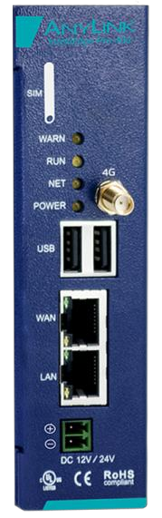
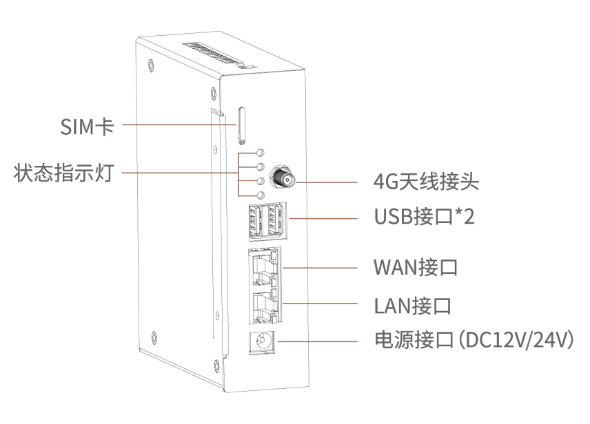
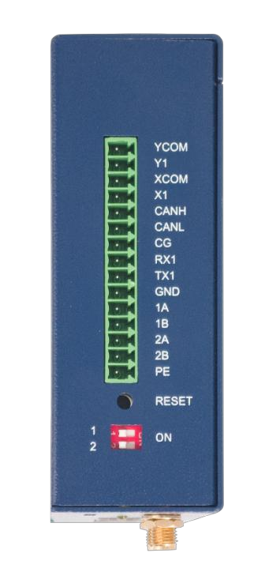
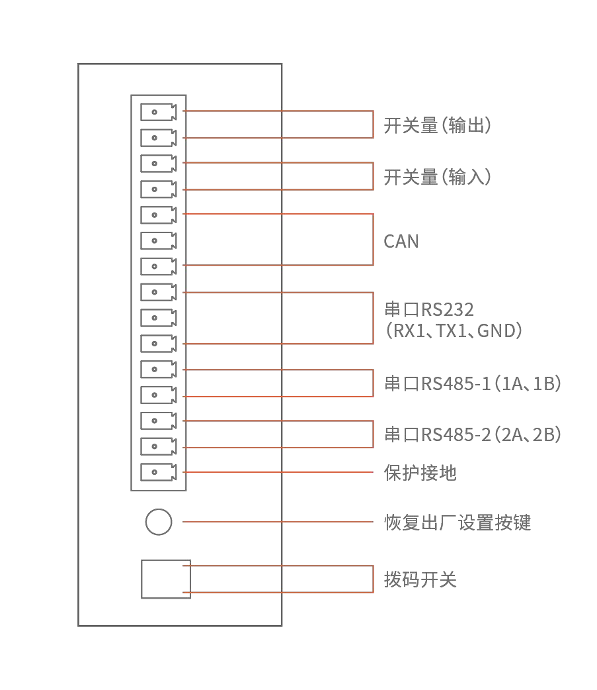
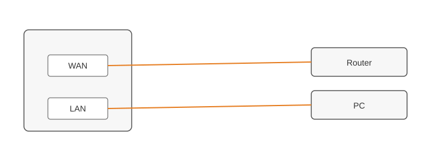
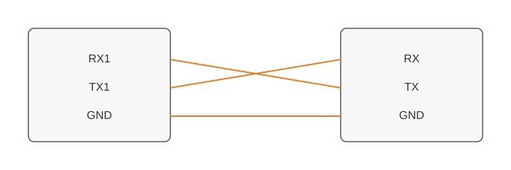
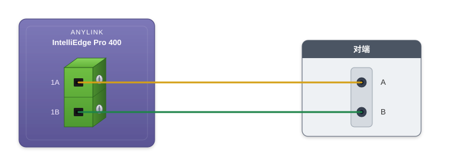

# IE Pro 400 Global Standard 快速上手指南

[English](../en/02-quickstart.md) | 中文

**适用型号**：IE Pro 400 Global Standard　**文档版本**：V1.0　**日期**：2026-07-22

## 前言

本指南帮助开发者在 15 分钟内完成设备开箱、上电、SSH 登录并验证联网能力，为后续的 4G/有线联网示例、Demo 开发做好准备。

> **说明**：IE Pro 400 Global Standard 不预装厂商 Web 管理界面，设备配置与调试通过 SSH 命令行完成。

## 1. 开箱清单

| 物品 | 数量 | 备注 |
|---|---|---|
| IE Pro 400 Global Standard 主机 | 1 | |
| 电源接线端子 | 1 套 | 配合 9～36 V DC 电源使用 |
| 4G 天线 | 1 根 | 接入设备 4G 天线接口 |
| DIN 导轨卡扣 | 1 套 | 用于导轨安装 |
| 快速上手卡片 | 1 | |

> **量产确认**：以上随箱清单已与 IE Pro 400 Global Standard 最终量产发货产品核对一致。

若清单不符，请联系紫清科技技术支持（[anylink.io](https://anylink.io)）。

## 2. 开机

1. 确认电源规格与设备铭牌一致（参见[规格书](01-datasheet.md) §2.3），使用 **9～36 V DC** 宽压电源。
2. 按接线端子极性标识连接电源，注意正负极不可接反。
3. 上电后观察指示灯：

   | 指示灯 | GPIO | 正常状态 | 说明 |
   |---|---|---|---|
   | POWER（电源） | — | 上电即亮 | 电源指示灯（硬件控制，非软件 GPIO） |
   | RUN（运行） | GPIO 71 | 点亮或周期性闪烁 | 系统正在运行 |
   | NET（网络） | GPIO 122 | 联网后点亮 | 网络链路已建立 |
   | WARN（警告） | GPIO 123 | 熄灭 | 点亮表示警告状态 |

4. 设备完成启动约需 **60～90 秒**（首次上电或插入 SIM 卡后可能略长）。

## 3. 接线

### 3.1 接口概览

| 接口 | 数量 | 说明 |
|---|---|---|
| 4G 蜂窝网络 | 1 | 接 4G 天线，插入 SIM 卡 |
| 有线以太网 | 2 | WAN + LAN，10/100 M 自适应 |
| RS485 | 2 | `/dev/ttymxc1`、`/dev/ttymxc2` |
| RS232 | 1 | `/dev/ttymxc5` |
| CAN 2.0 | 1 | `can0`（出厂已安装 CAN 模块） |
| USB 2.0 | 2 | USB 2.0 主机接口 |
| DI / DO | 各 1 | X1（GPIO 117）/ Y1（GPIO 118） |
| 拨码开关 | 2 | GPIO 121、GPIO 124 |
| Reset 按键 | 1 | GPIO 119 |

<table>
  <tr>
    <td colspan="2"><strong>前面板</strong></td>
  </tr>
  <tr>
    <td align="center" valign="middle" width="322">
      
    </td>
    <td align="center" valign="middle">
      
    </td>
  </tr>
  <tr>
    <td colspan="2"><strong>顶面端子排</strong></td>
  </tr>
  <tr>
    <td align="center" valign="middle" width="322">
      
    </td>
    <td align="center" valign="middle">
      
    </td>
  </tr>
</table>

### 3.2 以太网（WAN / LAN）

两路 RJ45 在**前面板**。使用标准网线接入即可。



首次 SSH 请将 PC 接到 **LAN**。典型用途与出厂默认 IP 见 §5.1。改 IP、ping 等见[《有线联网示例》](04-wired-connectivity.md)。

### 3.3 串口（RS232 / RS485）

现场三路串口在**顶面端子排**（端子分组见 §3.1），与 §5.3 的 Console 口不是同一接口。

| 端口 | 端子 | 设备节点 |
|---|---|---|
| RS232 | RX1、TX1、GND | `/dev/ttymxc5` |
| RS485-1 | 1A、1B | `/dev/ttymxc1` |
| RS485-2 | 2A、2B | `/dev/ttymxc2` |

**RS232**：RX1 接对端 **TX**，TX1 接对端 **RX**（交叉）；GND 接 GND。



**RS485**：下图以 **RS485-1** 为例。**1A** 接对端 **A**，**1B** 接对端 **B**。RS485-2 接法相同，端子为 **2A** / **2B**。请与对端设备核对 A/B 极性。



### 3.4 其他接线要点

| 接口 | 接线要点 |
|---|---|
| 电源 | 9～36 V DC，注意正负极；参见规格书 §2.3 |
| CAN | 总线两端建议各接 120 Ω 终端电阻；默认波特率 250000 bps |
| USB 2.0 | 标准 USB 2.0 主机接口，可连接外设及存储设备 |
| DI/DO | X1 无源输入（干接点，与 GND 短接触发）；Y1 无源输出（干接点） |
| SIM 卡 | 参见[《4G 联网示例》](03-4g-connectivity.md)第 1 节 |

## 4. 插卡

1. **断电**后打开 SIM 卡槽。
2. 按卡槽丝印方向插入标准 SIM 卡（金属触点朝向卡槽内侧弹片）。
3. 推入卡槽至卡扣锁定。
4. 重新上电，等待约 60 秒让模组完成初始化。

> 详细的 SIM 卡与 APN 配置流程见[《4G 联网示例》](03-4g-connectivity.md)。

## 5. 登录设备

### 5.1 出厂默认网络地址

| 网口 | 默认 IP | 子网掩码 | 典型用途 |
|---|---|---|---|
| WAN | `192.168.100.126` | `255.255.255.0` | 连接上级网络/出网 |
| LAN | `192.168.101.204` | `255.255.255.0` | 本地管理、PC 直连调试 |

首次通过 LAN 口 SSH 登录时，请将 PC 网卡设置为与 LAN 口同网段，例如 `192.168.101.100/24`。

### 5.2 SSH 登录（推荐）

1. 使用网线将 PC 连接至设备 **LAN 口**（`192.168.101.204`）。
2. 将 PC 网卡 IP 设置为 `192.168.101.x`（如 `192.168.101.100`），子网掩码 `255.255.255.0`。
3. SSH 登录：

   ```bash
   ssh root@192.168.101.204
   ```

4. **SSH 密码（一机一密）**：
   - 账号固定为 `root`。
   - 每台设备出厂时部署了**产品唯一码**，SSH 初始密码由厂家根据该唯一码生成，与设备一一绑定。
   - 唯一码通常印在设备铭牌或外包装标签上；初始密码请向厂家/经销商索取（提供唯一码即可查询）。
   - 登录成功后，建议立即使用 `passwd` 修改密码：

   ```bash
   passwd
   ```

### 5.3 串口 Console 登录

1. 使用 USB 转 TTL 串口线连接设备 Console 口。
2. 终端参数：**115200** 波特率，8 数据位，1 停止位，无校验，无流控。
3. 上电后在终端中使用账号 `root` 登录，密码规则与 SSH 相同（一机一密，绑定产品唯一码）。
4. 登录后同样可使用 `passwd` 修改密码。

## 6. 联网测试

### 6.1 有线联网

1. 出厂默认：WAN `192.168.100.126`，LAN `192.168.101.204`（参见 §5.1）。
2. 将 WAN 或 LAN 口接入路由器/交换机，或 PC 直连 LAN 口进行首次配置。
3. SSH 登录后查看当前 IP：

   ```bash
   ip addr show
   ```

4. 执行 ping 测试：

   ```bash
   ping -c 4 8.8.8.8
   ```

5. 确认返回无丢包即表示联网成功。修改 IP 配置见[《有线联网示例》](04-wired-connectivity.md)。

### 6.2 4G 联网

1. 确认 SIM 卡已插入且设备已上电。
2. 按[《4G 联网示例》](03-4g-connectivity.md) §2 开启 4G 模组电源（GPIO 69 置 1）。
3. 通过 AT 串口检查注册状态（详见同文档 §3、§4）。
4. 拨号成功后执行 `ping -c 4 8.8.8.8` 验证出网。

## 7. 下一步

### 7.1 安装交叉编译环境

若需在 PC 上编译 Demo 或自研程序，在 **Ubuntu x86_64** 上执行：

```bash
sudo apt install -y build-essential git make wget
cd IEPro-Global
sh scripts/setup_toolchain.sh
. scripts/env.toolchain.sh
make -C demo
```

详见[《交叉编译工具说明》](06-cross-compile-toolchain.md)「快速上手」章节（[English](../en/06-cross-compile-toolchain.md)）。

### 7.2 继续开发

- 开发者可参考[《Demo 开发示例》](05-demo-guide.md)开始基础数据采集与北向对接开发。
- 若使用配套 MQTT agent 与 Web 界面（不是 C Demo），见[《第三方 MQTT 协议》](07-third-party-protocol.md)。
- 遇到问题请先查阅[《常见问题 FAQ》](08-faq.md)。
